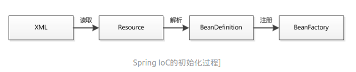

[TOC]

# Java基础知识 

## JVM

Java虚拟机是运行Java字节码的虚拟机。JVM有针对不同系统的特定实现，目的是使用相同的字节码，都会给出相同的结果。

## 字节码

> 在 Java 中，JVM可以理解的代码就叫做`字节码`（即扩展名为 `.class` 的文件），它不面向任何特定的处理器，只面向虚拟机。Java 语言通过字节码的方式，在一定程度上解决了传统解释型语言执行效率低的问题，同时又保留了解释型语言可移植的特点。所以 Java 程序运行时比较高效，而且，由于字节码并不针对一种特定的机器，因此，Java程序无须重新编译便可在多种不同操作系统的计算机上运行。


Java程序运行过程

## Java是编译与解释共存的语言

在.class->机器码的过程中，JVM类加载器首先加载字节码文件，然后通过解释器逐行解释执行，这种方式的执行速度会相对比较慢。而且，有些方法和代码块是经常需要被调用的(也就是所谓的热点代码)，所以后面引进了 JIT 编译器，而JIT 属于运行时编译。当 JIT 编译器完成第一次编译后，其会将字节码对应的机器码保存下来，下次可以直接使用。机器码的运行效率肯定是高于 Java 解释器的。

## JDK 和 JRE

JDK是Java Development Kit，它是功能齐全的Java SDK。它拥有JRE所拥有的一切，还有编译器（javac）和工具（如javadoc和jdb）。它能够创建和编译程序。

JRE 是 Java运行时环境。它是运行已编译 Java 程序所需的所有内容的集合，包括 Java虚拟机（JVM），Java类库，java命令和其他的一些基础构件。但是，它不能用于创建新程序。

## 自动内存管理机制

******************************

？？？？？？？

## 重载和重写

* 重载：同一个类，同名方法，参数不同（类型、个数、顺序、返回值、访问修饰符），<font color=red>发生在编译时</font>。
* 重写：发生在<font color=red>父子类</font>中，<font color=red>方法名、参数列表</font>必须相同，返回值范围小于等于父类，抛出的异常范围小于等于父类，访问修饰符范围大于等于父类；如果父类方法访问修饰符为 <font color=red>private</font> 则子类就不能重写该方法。

注：父类的私有属性和构造方法并不能被继承，所以也不能被重写（override），但是可以重载（overload）。

## 封装、继承、多态

* 封装：把对象属性私有化，同时提供可以被外界访问的属性的方法（get、set方法）

* 继承：使用已存在的类的定义作为基础建立新类。

  <font color=red>注意：</font>1. 子类拥有父类对象所有的属性和方法（包括私有属性和私有方法），但是父类私有的子类无法访问，**只是拥有**

* 多态：继承（多个子类对同一方法的重写）和接口（实现接口并覆盖接口中同一方法）。一个引用变量到底会指向哪个类的实例对象，该引用变量发出的方法调用到底是哪个类中实现的方法，必须在由程序运行期间才能决定。

  

## String、StringBuilder、StringBuffer

1. 操作少量的数据: 适用String（不可变的，线程安全的）

2. 单线程操作字符串缓冲区下操作大量数据: 适用StringBuilder（可变的，非线程安全的）

3. 多线程操作字符串缓冲区下操作大量数据: 适用StringBuffer（可变的、线程安全的）

   ```java
   //常量池中的对象
   String str = "abcd";
   //堆内存中的对象
   String str1 = new String("abcd") 
   ```

## 抽象类、接口类

**区别：**

* 接口的方法默认public，接口中不能有实现方法（java8可以），而抽象类可以有非抽象的方法。
* 接口中的实例变量默认是final类型的，而抽象类不一定。
* 一个类可以实现多个接口，但最多只能实现一个抽象类。
* 一个类实现接口的话要实现接口的所有方法，而抽象类不一定
* 接口不能用new实例化，但可以声明，必须引用一个实现该接口的对象。从设计层面来说，抽象是对类的抽象，是一种模板设计，而接口是对行为的抽象，是一种行为的规范。

备注:在JDK8中，接口也可以定义静态方法，可以直接用接口名调用。实现类和实现是不可以调用的。如果同时实现两个接口，接口中定义了一样的默认方法，则必须重写，不然会报错。

**抽象类必须要有抽象方法吗？**

抽象类中不一定包含抽象方法，但是包含抽象方法的类一定要被声明为抽象类。

**抽象类能使用 final 修饰吗？**

抽象类不能用final来修饰。当用final修饰一个类时，表明这个类不能被继承。final类中的所有成员方法都会被隐式地指定为final方法，这明显违背了抽象类存在的意义了。

## ==和equals

==：判断两个对象的地址是不是相同（是否是同一对象），数据类型比较值，引用类型比较内存地址。

equals()：判断两个对象是否相等。

* 类没有覆盖equals方法。则等价于“==”
* 类覆盖equals方法。比较内容是否相等。

## 反射

对于任意一个类，都能够知道并调用它的任意一个方法和属性。这种动态获取的信息以及动态调用对象的方法的功能称为java语言的反射机制。

### 静态编译和动态编译

- **静态编译：**在编译时确定类型，绑定对象
- **动态编译：**运行时确定类型，绑定对象 (反射的优点：解耦以及提高代码的灵活性)

### 优缺点

* 优点：运行期间类型的判断，动态加载类，提升代码灵活度。
* 缺点：性能瓶颈，反射相当于一系列解释操作，通知JVM要做的事情，性能比直接java代码要慢很多。

### 应用

* JDBC操作中数据库的链接
* Spring框架的应用（装载 Bean 的过程）

## Java中IO流

### java 中 IO 流分为几种？

- 按照流的流向分，可以分为输入流和输出流；
- 按照操作单元划分，可以划分为字节流和字符流；
- 按照流的角色划分为节点流和处理流。

### BIO、NIO、AIO

* BIO（Blocking I/O）：同步阻塞I/O模式（并发量小）
* NIO（New I/O）：同步非阻塞的I/O模型（高负载、高并发）
* AIO（Asynchronous I/O）：异步非阻塞I/O模型（基于事件和回调机制实现）

# Java集合框架

## List、Set、Map

* List：存储一组不唯一，有序的对象（顺序）
* Set：不允许重复的集合，不会有多个元素引用相同的对象（独一无二）
* Map：使用键值对存储。Key唯一，但引用对象可相同（用key来搜索）

## Arraylist、LinkedList

* 线程安全：都是不同步的，不保证线程安全
* 数据结构：Arraylist底层使用的是Object数组；LinkedList底层使用的是双向链表（jdk1.7取消了循环链表）
* 元素位置：ArrayList采用数组存储，插入和删除元素的时间复杂度是受元素位置的影响(指定删除i位置元素，O(n-i)i位置后的元素后移)；LinkedList采用链表存储，所以插入和删除元素的时间复杂度不受元素位置的影响（O(1)）
* 快速随机访问：（通过元素的序号快速获取元素对象—数组下标）LinkedList不支持，ArrayList支持（get(int index)方法）
* 内存空间占用：ArrayList的空间浪费主要体现在在list列表的结尾会预留一定的容量空间，而LinkedList的空间花费则体现在它的每一个元素都需要消耗比ArrayList更多的空间（因为要存放直接后继和直接前驱以及数据）

#### RandomAccess接口

```java
    public interface RandomAccess {
    }
```

标识实现这个接口的类具有随机访问功能

**list遍历方式选择：**

* 实现了RandomAccess接口的list，优选选择普通for循环，其次foreach
* 未实现RandomAccess接口的list，优先选择iterator遍历（foreach底层是iterator实现的）。大size数据不要用for循环

## ArrayList与Vector的区别

Vector类的所有方法都是同步的，线程安全。但是同步操作耗费大量时间


ArrayList是不同步的，在不需要保证线程安全时建议使用

## HashMap和Hashtable的区别


# 并发基础知识

## 进程

是程序的一次执行过程，是系统运行程序的基本单位，是动态的。

例：Java中，当启动main函数时就是启动了一个JVM进程，而main函数所在的线程就是这个进程中的一个线程，也称主线程。

## 线程

是一个比进程更小的执行单位。一个进程在其执行的过程中可以产生多个线程，共享进程的**堆**和**方法区**的资源，但每个线程有自己的**程序计数器**、**虚拟机栈**和**本地方法栈**。线程也被称为轻量级进程（切换负担小）。

## 程序计数器

程序计数器是一块较小的内存空间，可以看作是当前线程所执行的字节码的行号指示器。各线程之间计数器互不影响，独立存储，这类内存区域为“线程私有”的内存。

作用：

1. 字节码解释器通过改变程序计数器来依次读取指令，从而实现代码的流程控制（如：顺醋执行、选择、循环、异常处理）
2. 在多线程的情况下，程序计数器用于记录当前线程执行的位置，从而当线程被切换回来的时候能够知道该线程上次运行到哪了。

私有的主要目的：线程切换后能恢复到正确的执行位置

## Java虚拟机栈

描述的是Java方法执行的内存模型，每次方法调用的数据都是通过栈传递的。

## 堆

Java 虚拟机所管理的内存中最大的一块，Java 堆是所有线程共享的一块内存区域，在虚拟机启动时创建。**此内存区域的唯一目的就是存放对象实例，几乎所有的对象实例以及数组都在这里分配内存。

## 对象创建的过程


## 线程和进程的关系

进程是独立的，而同一进程中的线程极有可能会相互影响；线程执行开销小，但不利于资源的管理和保护，进程则正相反。

## 并发和并行

* 并发：同一时间段，多个任务都在执行（单位时间内不一定同时执行）。
* 并行：单位时间内，多个任务同时执行。

## 多线程可能存在的问题

并发编程的目的就是为了能提高程序的执行效率提高程序运行速度，但可能遇到比如：内存泄漏、上下文切换、死锁还有受限于硬件和软件的资源闲置问题。

## 线程的状态

初始状态 、运行状态、阻塞状态、等待状态、超时等待状态、终止状态

## 上下文切换

当前任务在执行完 CPU 时间片切换到另一个任务之前会先保存自己的状态，以便下次再切换会这个任务时，可以再加载这个任务的状态。**任务从保存到再加载的过程就是一次上下文切换**。

## 避免死锁

破坏产生死锁的四个条件中的其中一个就可以

**破坏互斥条件**

该资源任意一个时刻只由一个线程占用，这个条件无法破坏

**破坏请求与保持条件**

一个线程因请求资源而阻塞时，对已经获得的资源保持不放。解决：一次性申请所有的资源

**破坏不剥夺条件**

线程已经获得的资源在未使用完之前不能被其他的线程强行剥夺，只有自己使用完毕后才释放资源。解决：占用部分资源的线程进一步申请其他资源时，如果申请不到，可以主动释放它占有的资源。

**破坏循环等待条件**

若干线程之间形成一种头尾相接的循环等待资源关系。解决：靠按序申请资源来预防。

## sleep方法和wait方法

区别：

* sleep方法没有释放锁，wait方法释放了锁。
* sleep通常被用于暂停执行，wait用于线程间交互、通信。
* sleep方法执行完成后，线程会自动苏醒；wait方法调用后，线程不会自动苏醒，需要别的线程调用同一个对象上的notify或notifyAll方法。

共同点：两者都可以暂停线程的执行

## start和run方法

调用start方法可启动线程并使线程进入就绪状态，而run方法只是tread的一个普通方法调用，还是在主线程里执行。

# 数据库知识基础

## 事务

事务时逻辑上的一组操作，要么都执行，要么都不执行。

### 事务的四大特性

* 原子性：事务时最小的执行单位，不允许分割。确保动作要么全部完成，要么完全不起作用
* 一致性：执行事务前后，数据保持一致，多个事务对同一个数据读取的结果是相同的。（从一个一致的状态到另一个一致的状态）
* 隔离性：并发访问数据库时，一个用户的事务不被其他事务所干扰，各并发事务之间数据库时独立的。
* 持久性：一个事务被提交之后。对数据库中数据的改变时持久的，即使数据库发生故障也不应该对其具有任何影响。（一旦提交，数据的改变时永久性的）

### 并发事务带来的问题

* 读脏数据：一个事务修改了数据还未提交，另一个事务读取到的数据就是脏数据
* 丢失修改：两个事务进行数据读取，并修改。先后提交后，第一个提交的事务会丢失修改
* 不可重复读：一个事务重复读取同一数据，在过程中另一数据进行了修改提交，导致了第一个事务两次读到的数据不一致。
* 幻读：与不可重复读类似，数据读取结束后会发现有一些不存在的数据（另一个事务插入了数据或删除）。不可重复读的重点是修改，幻读的重点在于新增或者删除。

## drop、delete与truncate区别？

* drop：丢弃数据，删除表 ---数据定义语言，直接生效
* delete：删除数据 ---数据库操作语言，放到事务中回滚
* truncate：清空数据（id从0开始）  ---数据定义语言，直接生效

# 索引

优点：

* 通过创建唯一索引，保证数据库标每一行数据的唯一性。
* 加快数据检索速度
* 避免排序和临时表
* 随机IO变为顺序IO
* 加速表和表之间的连接

缺点：

# Spring常见问题


### IoC和AOP

IoC（控制反转）：

一种设计思想，将原本在程序中手动创建对象的控制权，交由Spring框架来控制。IoC容器实际上就是Map（Key，value），Map中存放的是各种对象。


IoC容器就像一个工厂，当需要创建一个对象的时候，只需要配置好配置文件/注解即可。不需要考虑对象是如何被创建出来的。



AOP（面向切面编程）：

封装业务模块所共同调用的逻辑或责任（例如 事务处理、日志管理、权限控制等），便于减少系统的重复代码，降低模块间的耦合度，并有利于未来的可扩展和可维护性。


Spring AOP基于动态代理。对于实现了某个接口的对象使用JDK Proxy创建代理对象；没有实现接口的对象使用Cglib，生成一个被代理对象的子类来作为代理。

### Spring中用到的设计模式

<https://mp.weixin.qq.com/s?__biz=Mzg2OTA0Njk0OA==&mid=2247485303&idx=1&sn=9e4626a1e3f001f9b0d84a6fa0cff04a&chksm=cea248bcf9d5c1aaf48b67cc52bac74eb29d6037848d6cf213b0e5466f2d1fda970db700ba41&token=255050878&lang=zh_CN#rd>